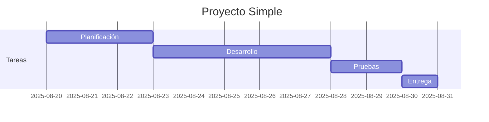

#review  
**Enlace**: 
**Tema General**:Planificación y Gestión de Proyectos
## Esencia semántica
+ Un **diagrama de Gantt** es una representación visual que muestra la **planificación temporal de tareas o actividades** dentro de un proyecto. 
+ Permite visualizar **inicio, duración y dependencia** de cada tarea a lo largo del tiempo
+ El diagrama de Gantt organiza las actividades en **barras horizontales** que representan la duración de cada tarea sobre un **eje temporal**. 
+ Se utiliza en gestión de proyectos para programar tareas, asignar recursos y seguir el progreso. 
+ Las dependencias entre tareas se indican mediante flechas que conectan actividades relacionadas.
## Puntos clave
+ Visualiza tareas y su duración en un calendario.
- Permite identificar dependencias entre actividades.
- Facilita la planificación, seguimiento y control del proyecto.
- Ayuda a asignar recursos de manera eficiente.
- Permite detectar retrasos o cuellos de botella en el cronograma.

## Características
- Temporal: refleja inicio, duración y fin de tareas.
- Secuencial y dependiente: muestra relaciones entre actividades.
- Visual: barras horizontales para cada tarea.
- Flexible: se puede adaptar a proyectos simples o complejos.
- Actualizable: permite reflejar avances o cambios en el proyecto.

## Analogía
> *Un diagrama de Gantt es como **una agenda visual de un proyecto**, donde cada tarea tiene su espacio de tiempo y se puede ver de un vistazo qué se hace, cuándo y quién lo hace.*

## Ejemplo
