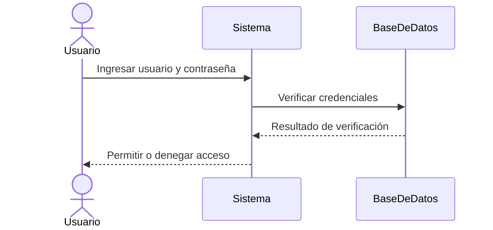

#review 
**Enlaces**: [[Diagramas]]
**Tema General**: Modelado de Interacciones en Sistemas
## Esencia semántica
+ Un **diagrama de secuencia** es una representación gráfica que muestra cómo los **objetos o componentes de un sistema interactúan entre sí** a lo largo del tiempo.
+ Se centra en el orden de los mensajes y la comunicación, más que en la estructura estática de los elementos.
+ El diagrama de secuencia forma parte de los **diagramas de comportamiento de UML (Unified Modeling Language)**. 
+ Cada objeto o actor se representa con una **línea de vida vertical**, y las interacciones se muestran mediante **flechas horizontales**, indicando el envío de mensajes, llamadas a métodos o respuestas. 
+ Es útil para analizar **procesos complejos**, flujo de información y detectar posibles fallas en el diseño.
## Puntos clave
- Representa la interacción temporal entre objetos o actores.
- Muestra mensajes, llamadas a métodos y retornos.
- Ayuda a entender la lógica de un caso de uso específico.
- Facilita la identificación de errores en el flujo de comunicación.
- Permite documentar y comunicar la dinámica de un sistema.
## Características
- Secuencial: sigue la línea temporal de las interacciones.
- Estandarizado: utiliza símbolos UML para objetos, mensajes y activaciones.
- Visual: refleja claramente quién hace qué y cuándo.
- Flexible: aplicable a sistemas de software, procesos de negocio o interacción entre componentes.
## Analogía
> *Un diagrama de secuencia es como **un guion de teatro**: indica qué actor dice qué línea y en qué momento, asegurando que la historia (proceso) se desarrolle de manera correcta.*

