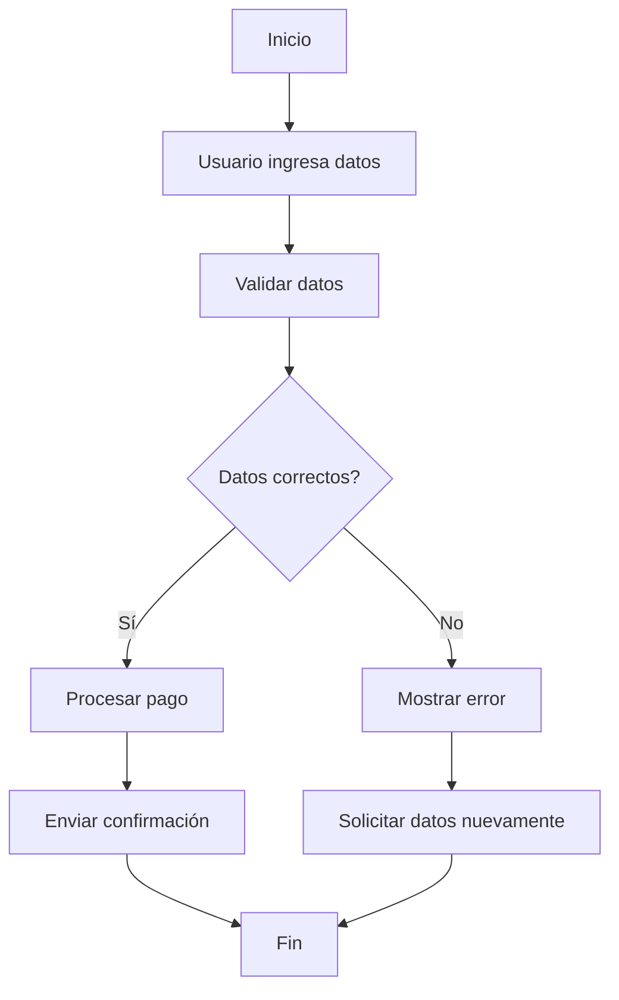

 #review 
**Enlaces**: [[Diagramas]]
**Tema General**: Representación de Procesos
## Esencia semántica
+ El diagrama de flujo utiliza **símbolos estandarizados** conectados por **flechas** para ilustrar el flujo de acciones. 
+ Cada símbolo representa un tipo de acción o decisión: inicio, operación, entrada/salida, decisión, terminación, entre otros.
+  Este tipo de [[Diagramas]] facilita la comprensión y permite detectar errores, redundancias o mejoras en un proceso.
+ Un **diagrama de flujo** es una representación gráfica que muestra la secuencia de pasos, decisiones y operaciones dentro de un proceso. 
+ Se utiliza para entender, analizar y comunicar cómo funciona un procedimiento, ya sea en [[programación]], procesos empresariales o toma de decisiones.
## Puntos clave
- Representa procesos de manera visual y secuencial.
- Utiliza símbolos estandarizados (rectángulo, rombo, óvalo, paralelogramo).
- Ayuda en la planificación, documentación y optimización de procesos.
- Facilita la comunicación entre distintos miembros de un equipo.
- Permite identificar errores o cuellos de botella en procedimientos.
## Características
- Secuencial: las acciones siguen un orden lógico.
- Condicional: incluye decisiones con ramificaciones (sí/no).
- Estandarizado: cada símbolo tiene un significado concreto.
- Flexible: puede aplicarse a cualquier tipo de proceso, técnico o administrativo.
- Visual: facilita la comprensión rápida del flujo de un proceso.
## Analogía
> *Un diagrama de flujo es como un **mapa de ruta**: indica los caminos posibles desde un punto de partida hasta el destino final, mostrando los desvíos y decisiones en el camino.*

## Ejemplo con mermaid

