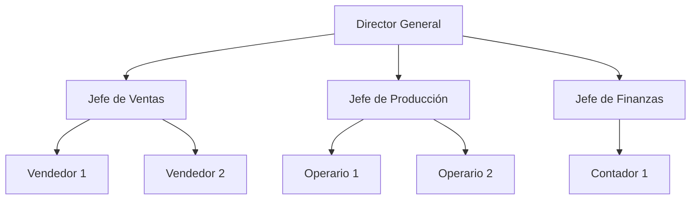

 #review  
**Enlaces**: [[Diagramas]]
**Tema General**: Representación de Jerarquías y Estructuras Organizacionales
## Esencia semántica
+ Un **diagrama de organigrama** es una representación gráfica que muestra la **estructura jerárquica de una organización**, destacando las relaciones de autoridad y responsabilidad entre sus miembros, departamentos o áreas.
+ El organigrama visualiza cómo se distribuyen las funciones y niveles de autoridad dentro de una organización. 
+ Cada **caja o nodo** representa un puesto, persona o departamento, y las **líneas de conexión** indican relaciones jerárquicas o funcionales. 
+ Este tipo de diagrama facilita la comprensión de la estructura interna y la asignación de roles.
## Puntos clave
- Representa la jerarquía y relaciones de autoridad.
- Facilita la comprensión de la estructura organizacional.
- Ayuda en la planificación, gestión y comunicación interna.
- Puede ser vertical, horizontal o circular según el diseño.
- Permite identificar duplicaciones, vacíos o mejoras en la estructura.
## Características
- Jerárquico: refleja niveles de autoridad y subordinación.
- Visual: fácil de interpretar mediante cajas y líneas.
- Flexible: adaptable a empresas, proyectos o equipos.
- Documentativo: sirve como guía de roles y responsabilidades.
## Analogía
> *Un organigrama es como un **árbol genealógico**, donde cada rama muestra las relaciones entre padres (superiores) e hijos (subordinados), dejando claro quién depende de quién*

## Ejemplo
