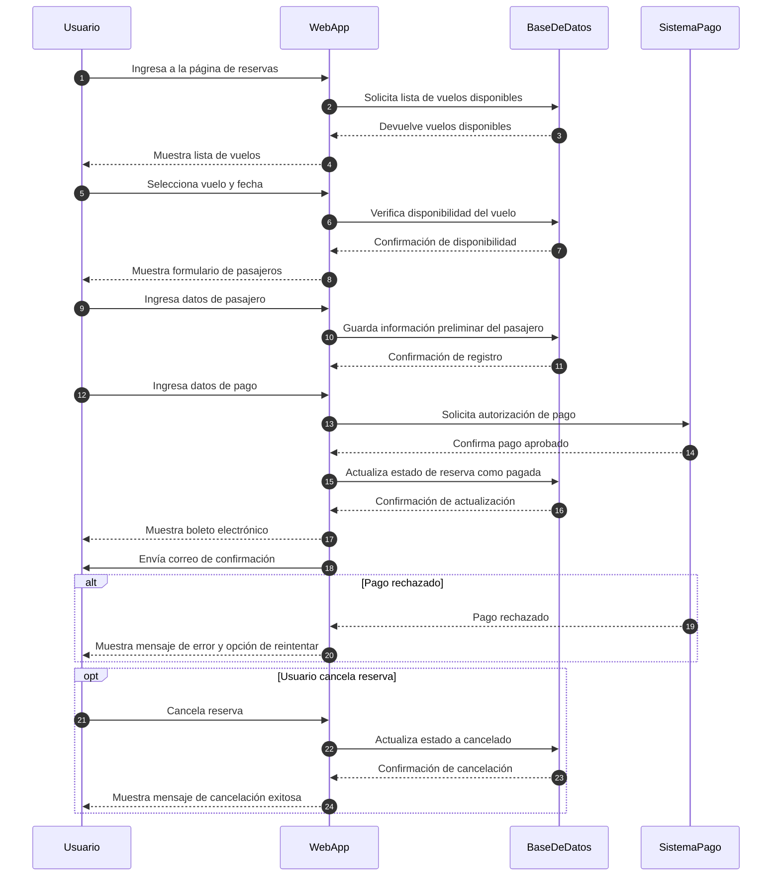

```mermaid
sequenceDiagram
    autonumber
    participant U as Usuario
    participant WS as WebApp
    participant DB as BaseDeDatos
    participant PS as SistemaPago

    %% Inicio del flujo
    U->>WS: Ingresa a la página de reservas
    WS->>DB: Solicita lista de vuelos disponibles
    DB-->>WS: Devuelve vuelos disponibles
    WS-->>U: Muestra lista de vuelos

    %% Usuario selecciona vuelo
    U->>WS: Selecciona vuelo y fecha
    WS->>DB: Verifica disponibilidad del vuelo
    DB-->>WS: Confirmación de disponibilidad
    WS-->>U: Muestra formulario de pasajeros

    %% Usuario ingresa datos
    U->>WS: Ingresa datos de pasajero
    WS->>DB: Guarda información preliminar del pasajero
    DB-->>WS: Confirmación de registro

    %% Proceso de pago
    U->>WS: Ingresa datos de pago
    WS->>PS: Solicita autorización de pago
    PS-->>WS: Confirma pago aprobado
    WS->>DB: Actualiza estado de reserva como pagada
    DB-->>WS: Confirmación de actualización

    %% Confirmación final
    WS-->>U: Muestra boleto electrónico
    WS->>U: Envía correo de confirmación

    %% Flujo alternativo: Pago rechazado
    alt Pago rechazado
        PS-->>WS: Pago rechazado
        WS-->>U: Muestra mensaje de error y opción de reintentar
    end

    %% Flujo opcional: Reserva cancelada
    opt Usuario cancela reserva
        U->>WS: Cancela reserva
        WS->>DB: Actualiza estado a cancelado
        DB-->>WS: Confirmación de cancelación
        WS-->>U: Muestra mensaje de cancelación exitosa
    end

```