#review  
**Enlace**: [[mermaid]]
**Tema General:** Lenguaje de Diagramación
## Diagrama de flujo:

```mermaid
flowchart TD
A[Inicio] --> B{Condición}
B -->|Sí| C[Acción 1]
B -->|No| D[Acción 2]

```

**Direcciones**

- `TD` = Top → Down
- `BT` = Bottom → Top
- `LR` = Left → Right
- `RL` = Right → Left
    
🔹 **Formas de nodos**
- `A[Texto]` → Rectángulo
- `A( )` → Redondeado
- `A{ }` → Rombo (decisión)
- `A(( ))` → Círculo
- `A[/Texto/]` → Caja con borde especial
- `A>Texto]` → Caja asimétrica
    

🔹 **Conexiones**
- `A --> B` → Flecha normal
- `A --- B` → Línea sin flecha
- `A -.-> B` → Flecha punteada
- `A-->|Etiqueta|B` → Flecha con texto
## Diagrama de secuencia:

**Participantes y mensajes**

- `Actor->>Actor2: Mensaje` → Llamada síncrona
- `Actor-->>Actor2: Mensaje` → Llamada asíncrona

🔹 **Bloques**
- `loop Nombre` … `end` → Bucle
- `alt Condición` … `else` … `end` → Alternativa
- `par Paralelo` … `end` → Procesos en paralelo
- `rect rgb(200,200,200)` … `end` → Bloque coloreado
## Diagrama de Gantt

**Elementos principales**
- `gantt` → Inicio del diagrama
- `dateFormat` → Formato de fecha
- `title` → Título del diagrama
- `section Nombre` → Agrupación de tareas
**Definición de tarea**
`Nombre :estado, id, inicio, duración`
 **Estados**:
- `done` = completada
- `active` = en curso
- `crit` = crítica
- `milestone` = hito
## Organigrama

🔹 No existe sintaxis nativa "organigrama", se usa **`flowchart`** con jerarquías verticales (`TD`).
- Nodos → cargos o roles.
- Flechas → relaciones jerárquicas.