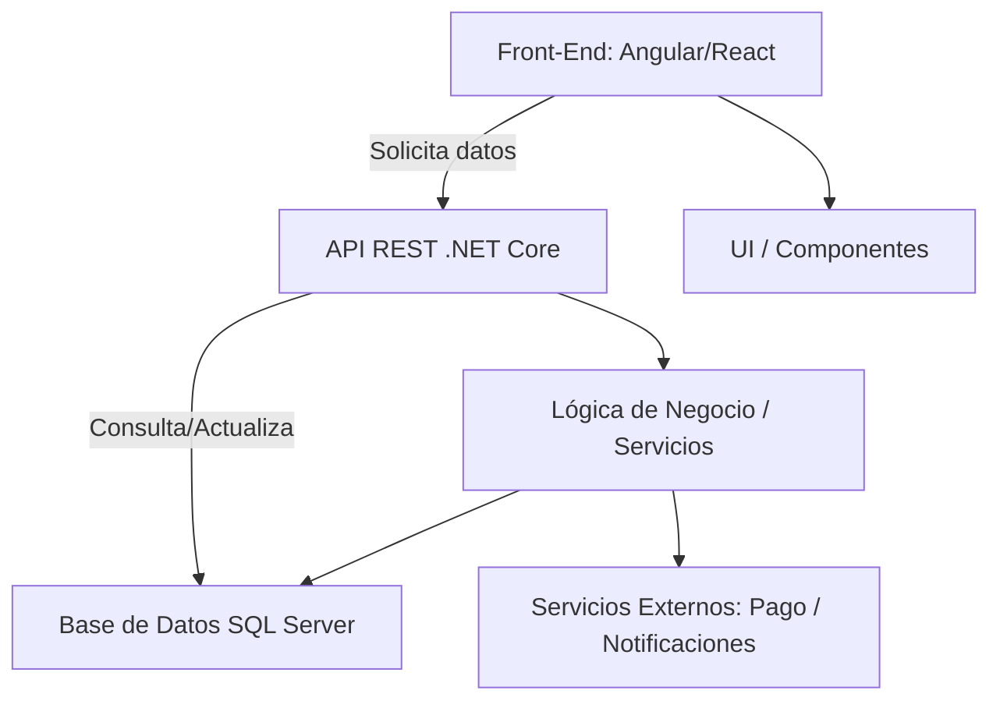

 #review  #noEstructurado 

**Tema General**: Fundamentos y Organización de Sistemas
## Esencia semántica

## Puntos clave

## Características

## Analogía
> *analogía*

La **arquitectura de software** define la estructura de un sistema de software, sus componentes, la forma en que se comunican y las decisiones de diseño que determinan su comportamiento y evolución. Su propósito es **garantizar calidad, escalabilidad, mantenibilidad y eficiencia** en el desarrollo de software complejo, estableciendo un marco claro para diseñadores y desarrolladores.

---

### Concepto

La arquitectura de software es el **conjunto de decisiones estructurales** que guían la construcción de un sistema. Incluye:

- **Componentes o módulos**: unidades funcionales que encapsulan lógica y datos.
    
- **Conexiones y comunicaciones**: protocolos y flujos de información entre componentes.
    
- **Patrones arquitectónicos**: soluciones recurrentes para problemas comunes (ej. MVC, MVVM, Microservicios).
    
- **Restricciones y reglas de diseño**: estándares, normas de seguridad, performance y escalabilidad.
    

Una buena arquitectura permite que los desarrolladores trabajen de forma organizada, facilita pruebas, mantenimiento y evolución del sistema sin introducir errores críticos.

---

### Puntos Clave

- Define **componentes y sus relaciones**.
    
- Establece **patrones y convenciones** de diseño.
    
- Mejora **calidad, escalabilidad y mantenibilidad**.
    
- Permite identificar **riesgos y puntos críticos** del sistema.
    
- Facilita la **comunicación entre equipos** y documentación técnica.
    

---

### Características

- **Modularidad**: separación clara de responsabilidades.
    
- **Reusabilidad**: componentes que se pueden usar en otros sistemas.
    
- **Flexibilidad y escalabilidad**: adaptación a cambios y crecimiento del sistema.
    
- **Performance y eficiencia**: optimización de recursos y tiempos de ejecución.
    
- **Sustentabilidad**: arquitectura que permite mantenimiento y evolución sin reescribir todo el sistema.
    

---

### Analogía

La arquitectura de software es como el plano de un edificio:

- Define **las habitaciones** (componentes),
    
- **Cómo se conectan** (pasillos y escaleras, es decir, flujos y comunicación),
    
- **Materiales y normas de construcción** (reglas de diseño y estándares),
    
- Permitiendo que el edificio sea seguro, funcional y escalable.
## Ejemplo
