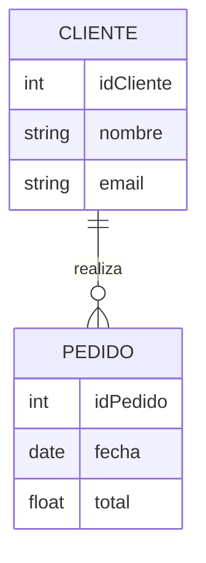

## **Tema General**: Modelo Conceptual
**Etiquetas**: #review #bdd/modelado 
**Enlaces**: [[Tipos de modelos Conceptual, Lógico y Físico]]

---

## Definición y Propósito

+ El **modelo conceptual** es la **representación abstracta y de alto nivel** de la estructura de una base de datos. 
	+ Su objetivo no es cómo se almacenan los datos físicamente, sino **qué información se maneja y cómo se relaciona**.
+ Representa **entidades**, **atributos** y **relaciones** entre los datos de 
	+ un dominio específico.
	    
+ Se centra en **la comprensión del negocio** o sistema, 
	+ sin preocuparse por restricciones técnicas o de almacenamiento.
	    
+ Sirve como **puente entre los requerimientos del usuario y el diseño lógico** de la base de datos.

---

## Elementos Clave

1. **Entidades:** Objetos o conceptos sobre los que se almacena información (ej. Cliente, Producto).
    
2. **Atributos:** Propiedades de cada entidad (ej. nombre, fecha de nacimiento).
    
3. **Relaciones:** Conexiones entre entidades (ej. Cliente realiza Pedido).
    
4. **Cardinalidad:** Indica cuántas entidades participan en la relación (uno a uno, uno a muchos, muchos a muchos).

---

## Características

+ **Independiente de SGBD:** No depende de un motor de base de datos específico.
    
+ **Abstracto:** No define cómo se implementarán las tablas o índices.
    
+ **Visual:** Frecuentemente representado mediante **diagramas ER (Entidad-Relación)**.

---

## Analogía

Es como dibujar un **mapa del terreno** antes de construir una casa: sabes qué habitaciones habrá y cómo se conectan, pero todavía no decides materiales, tamaño exacto ni colores.

---

## Ejemplo de Representación

+ **Entidades:** Cliente, Pedido
+ **Atributos:** Cliente → idCliente, nombre, email; Pedido → idPedido, fecha, total
+ **Relación:** Cliente realiza Pedido (uno a muchos)

---

